# Pictura Online Printing

## Description
This is an online printing website where customers are able to store their photos and print them when they wish to. It contains an admin section where the orders can be viewed and downloaded. The tools and technologies used to build this application are: 
- NodeJS
- Apollo Server
- Bcrypt and JWS for authentication
- Cloudinary for image storage
- Stripe for payment
- MongoDB 
- FileSaver and JSZip for files downloading
- React
- Tailwind CSS 
- Heroku for deployment

## Usage
The top navigation has the following links: 

### As a Customer
- Home
- Sign in / Sign out / Sign up
- Pictures
- Contact Us

### As an Admin
- Home
- Sign in / Sign out 
- Orders

## Home 
Home for both customer and admin is a landing page
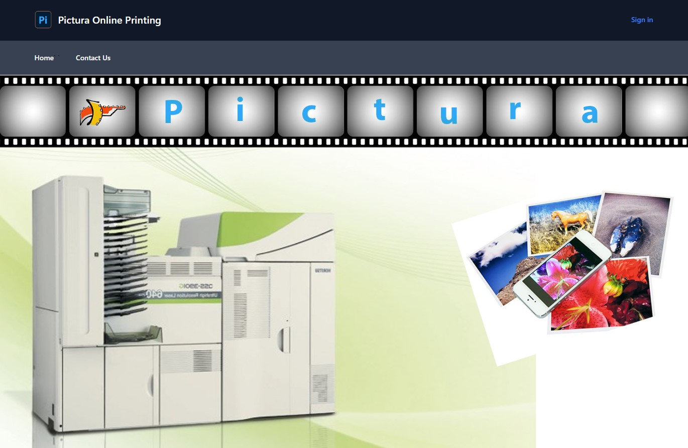

## Sign In 
Enter email and password and click Sign in to log in the website
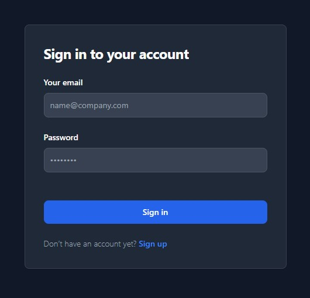

## Sign Up
As a new member, enter your details and choose a password and click Sign up
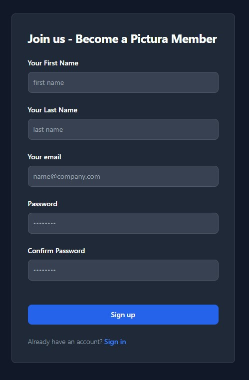

## Pictures (Customer)
After signing in, a customer can view their existing pictures, upload new pictures and place print orders

## Uploading Pictures
Choose the pictures to be uploaded from the file picker and click upload. Multiple files upload is supported. After uploading the pictures, they will show on the page.
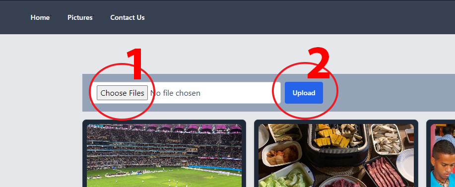

## Adding an item to shopping cart
Choose a picture dimension to be printed for each photo and click 'Add to cart' button. 
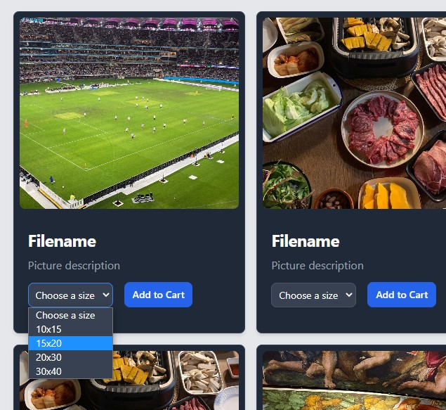

The number of items added to the shopping cart can be seen on the 'My Cart' button. Click on the 'My Cart' button to view the cart items and proceed to payment

## My Cart
A list and description of the items added to the cart. The quantity for each item can be added and substracted by clicking on the + and - buttons. The prices will update accordingly. Click 'Remove' to remove an item from the cart and click 'Make Payment' to proceed to payment
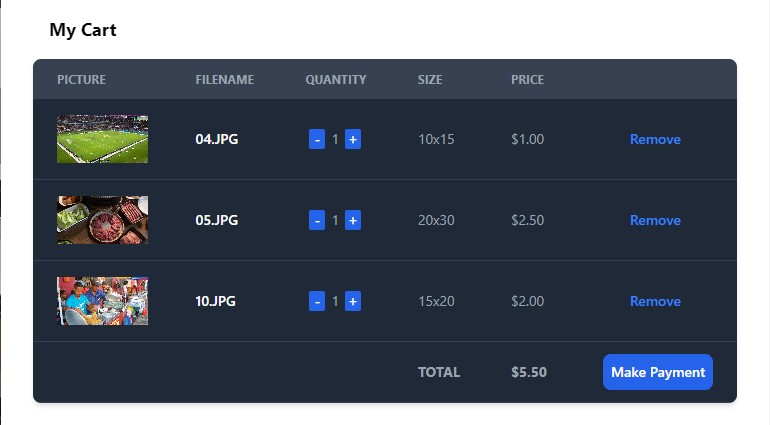

## Payment
A sumary of the order is listed on the left. To cancel, click on the left arrow on the top left. To proceed, enter email, card details and region, then click the 'Pay' button. 
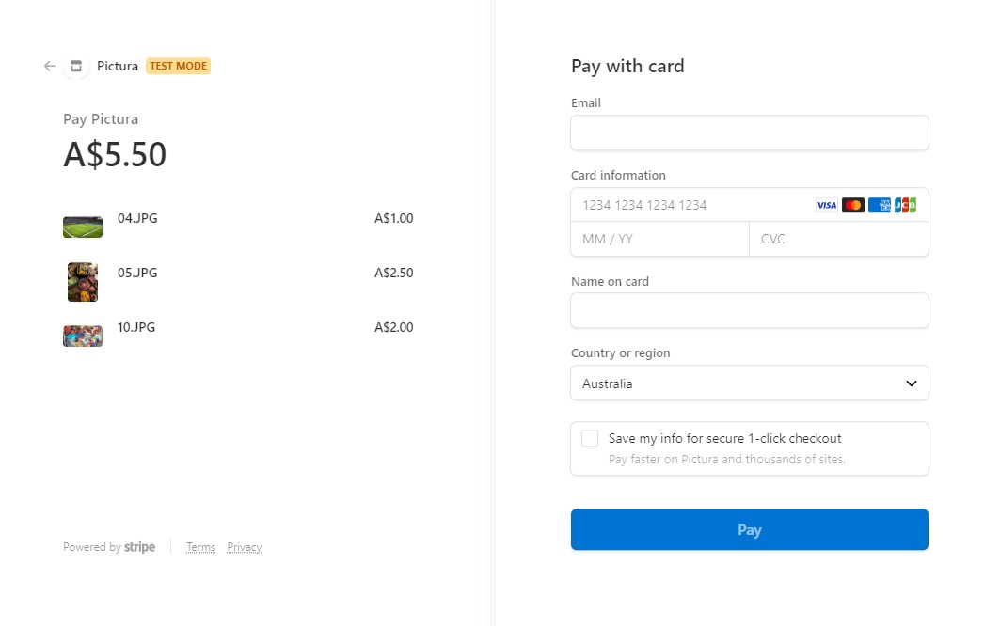

## Success
On successful payment, the payment details are shown
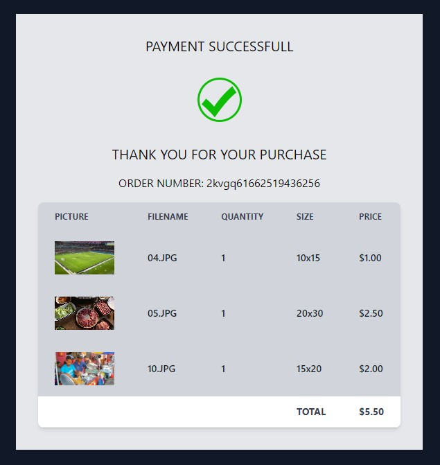

## View Orders (Admin)
Click on orders on navigation to get a list of orders. They are listed by the 'Open' status by default. 
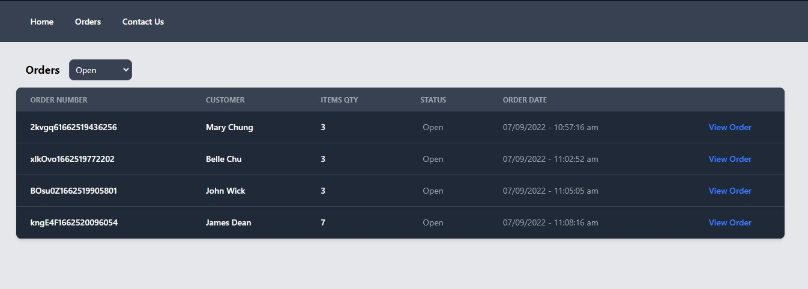

To view other orders status, pick from the drop list
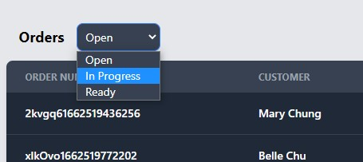

To view an order, click on 'View Order'. The order details are shown and click Download to download the files for printing. After downloading, the order status is updated to 'In Progress' and we are redirected to the orders page. 
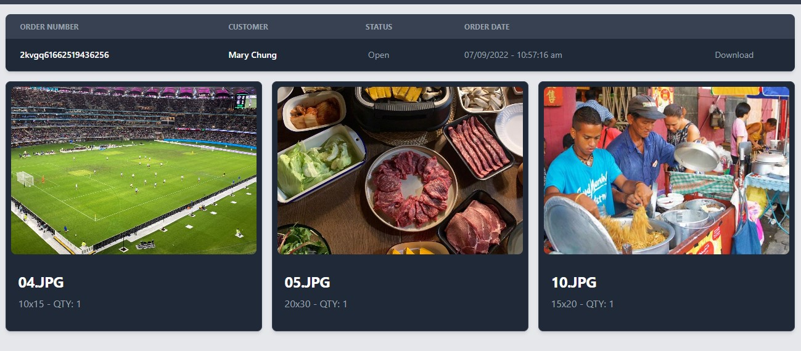

## Link to deployed application
[Visit Site: Pictura Online](https://pictura-online.herokuapp.com/)

